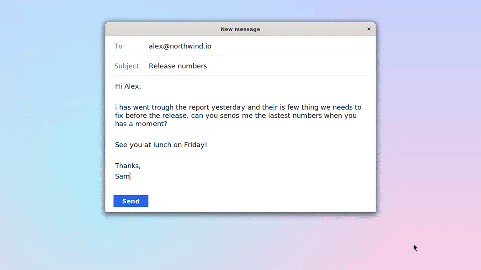
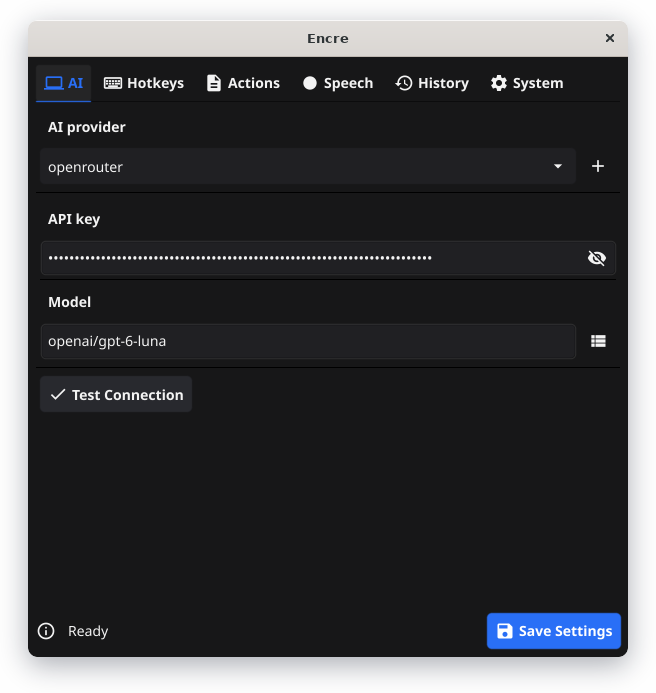
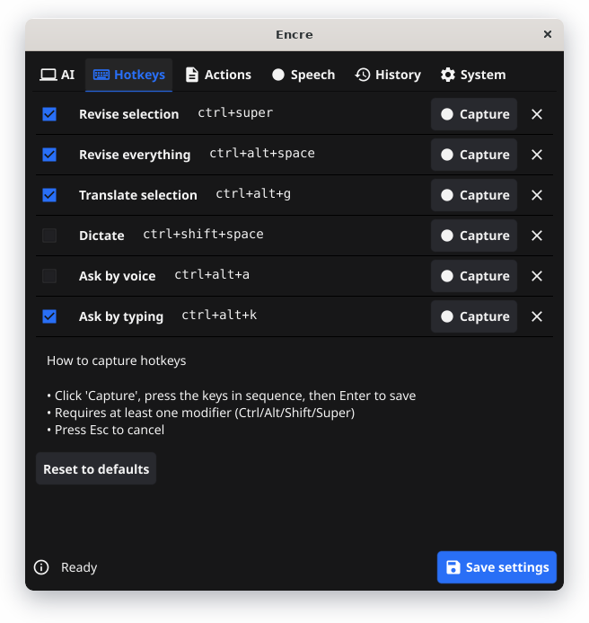
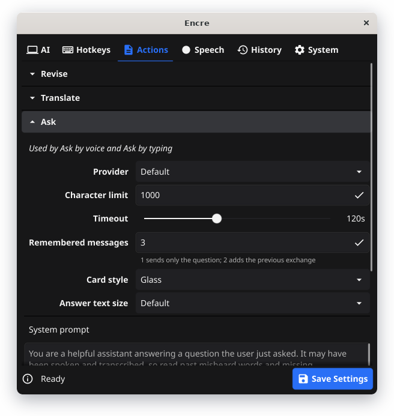
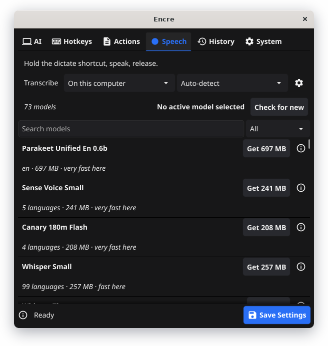
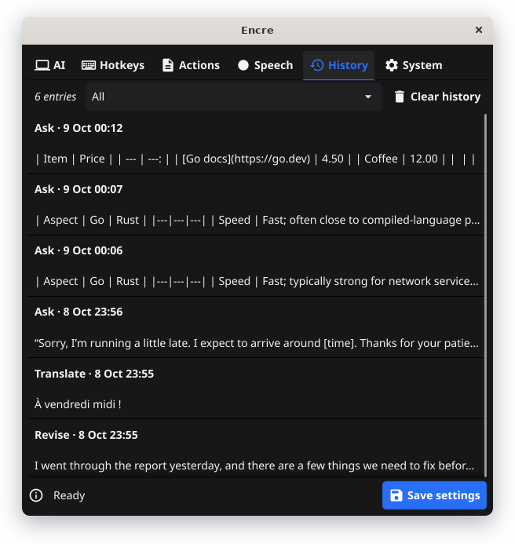
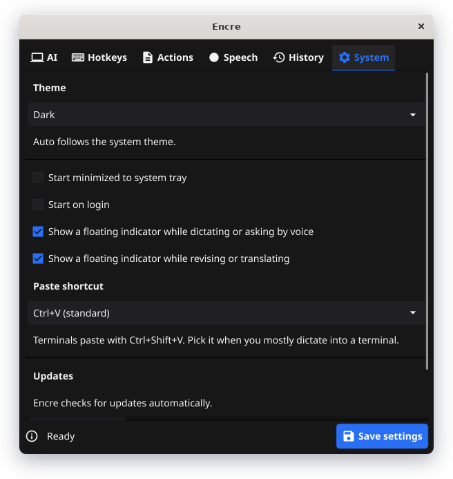

# Encre

[](https://github.com/paradoxe35/encre/actions/workflows/build.yml)
[](https://opensource.org/licenses/MIT)

Revise, translate and dictate text, and ask questions, with AI, anywhere on your computer.

## Table of contents

- [Why I built this](#why-i-built-this)
- [Demo](#demo)
- [Features](#features)
- [Install](#install)
- [Quick start](#quick-start)
- [Hotkeys](#hotkeys)
- [AI providers](#ai-providers)
- [Dictate](#dictate)
- [Ask](#ask)
- [Configuration](#configuration)
- [Building from source](#building-from-source)
- [Troubleshooting](#troubleshooting)
- [Screenshots](#screenshots)
- [License](#license)

## Why I built this

English isn't my first language, and I got tired of copying text into a chatbot and back just to fix a typo. Encre sits in your system tray: select text, press a hotkey, and it comes back revised, right where you wrote it. It translates, dictates and answers questions the same way. One hotkey, no app switching.

## Demo



More demos: [Revise](assets/demos/revise.gif) · [Translate both ways](assets/demos/translate.gif) · [Ask and follow up](assets/demos/ask.gif) · [Card styles](assets/demos/card-styles.gif)

## Features

| Action              | What happens                                                          |
| ------------------- | --------------------------------------------------------------------- |
| Revise selection    | Select text, press the hotkey, it comes back revised                  |
| Revise everything   | Same, for the whole field                                             |
| Translate selection | Translates between your two languages, choosing the direction for you |
| Dictate             | Hold the hotkey, talk, and your words are typed where the cursor is   |
| Ask by voice        | Hold the hotkey, ask a question, and the answer appears in a card     |
| Ask by typing       | Press the hotkey, type a question, and the answer appears in the card |

Text is replaced in place, and your clipboard is put back the way you left it.

## Install

Download the [latest release](https://github.com/paradoxe35/encre/releases/latest) for your system:

- **Windows**: run the installer, or extract the portable ZIP
- **macOS**: open the DMG (or unzip the ZIP) and drag Encre to Applications. On first launch, right-click > Open. If macOS still refuses it, use System Settings > Privacy & Security > Open Anyway, or run `xattr -cr /Applications/Encre.app`
- **Linux**: use the .deb, .rpm or Arch package, the AppImage, or the portable archive

Grant the accessibility/input permission when asked: global hotkeys need it.

**Linux on Wayland** needs your user in the `input` group (X11 works out of the box):

```bash
sudo usermod -aG input $USER   # then log out and back in
```

**Linux packages**, if you don't use the .deb (which installs them for you):

```bash
sudo apt install libgl1 libx11-6 libxext6 libxcb1 libxinerama1 libxtst6 libxdo3 libxkbcommon0 libxi6 libxcursor1 libxrandr2 libxrender1 libxfixes3 libxxf86vm1 libasound2
```

## Quick start

1. Launch Encre; it appears in your system tray
2. Right-click the tray icon > Settings
3. Under **AI**, add an API key for OpenAI, Claude, Gemini or OpenRouter
4. To dictate, switch Dictate on under **Hotkeys**, then download a speech model under **Speech**
5. Select some text anywhere and press the hotkey

## Hotkeys

| Action              | Linux              | Windows            | macOS               |
| ------------------- | ------------------ | ------------------ | ------------------- |
| Revise selection    | `Ctrl+Super`       | `Ctrl+Win`         | `Ctrl+Cmd`          |
| Revise everything   | `Ctrl+Alt+Space`   | `Ctrl+Alt+Space`   | `Ctrl+Option+Space` |
| Translate selection | `Ctrl+Alt+G`       | `Ctrl+Alt+G`       | `Ctrl+Option+G`     |
| Dictate             | `Ctrl+Shift+Space` | `Ctrl+Shift+Space` | `Ctrl+Shift+Space`  |
| Ask by voice        | `Ctrl+Alt+A`       | `Ctrl+Alt+A`       | `Ctrl+Option+A`     |
| Ask by typing       | `Ctrl+Alt+K`       | `Ctrl+Alt+K`       | `Ctrl+Option+K`     |

Only Revise selection and Revise everything are on at first. Switch the others on, or change any hotkey, under Settings > Hotkeys.

## AI providers

| Provider   | Default model         | Other examples                          |
| ---------- | --------------------- | --------------------------------------- |
| OpenAI     | gpt-6-luna            | gpt-6-sol, gpt-5-nano                   |
| Claude     | claude-haiku-4-5      | claude-sonnet-5                         |
| Gemini     | gemini-3.1-flash-lite | gemini-3.5-flash, gemini-2.5-flash-lite |
| OpenRouter | openai/gpt-6-luna     | any model it serves                     |

- Add any OpenAI-compatible provider (a local LLM, Together AI) with its own base URL, with or without an API key
- Each action can use its own provider, and starting a selection with `@provider` sends that one request to a specific provider
- Each action's prompt is editable under Settings > Actions; leave it empty to use the built-in
- Translation works between a language pair you pick (88 languages), detecting which of the two you wrote in

## Dictate

Hold the Dictate hotkey, talk, release: the transcript is typed at your cursor. To press once to start and again to stop instead, set `push_to_talk` to `false` for it in `config.json`.

- Speech recognition runs **locally by default**, so audio never leaves your machine. Choose from 70+ speech models (Whisper, Parakeet, Moonshine, Voxtral and others), fastest on your machine first; some transcribe while you speak
- Drop your own `.gguf` or `.bin` into `~/.encre/models` and it shows up in the list
- Or use a hosted service: OpenAI, Groq, or anything OpenAI-compatible
- Optionally clean the transcript up with your AI provider before it's typed
- Other audio fades down while you talk and back up after; switch it off under Speech

## Ask

Ask the AI without leaving what you're doing. The answer streams into a small card; nothing is typed into your app.

- **By voice**: hold the Ask by voice hotkey, say your question, release. It uses the speech model set under Settings > Speech
- **By typing**: press the Ask by typing hotkey and type. `Enter` sends, `Shift+Enter` adds a line
- Follow up from the card's input, copy an answer with its button, and close it with `Esc` from any window
- **Remembered messages**: Ask forgets by default. Set it to 2 to send the previous question and answer along with a new one, up to 100. The oldest drop out past about 24,000 characters, and Clear history in the History tab makes it forget
- **Tools**: switch on "Let Ask look things up" and it can search the web, read a page, look things up on Wikipedia and check the weather, all free and with no API key. The card shows what it's looking up while it does
- **Card style**: Solid, Glass, Graphite, Midnight, Aurora, Paper or Terminal, in four text sizes

Ask always knows your local date, time and operating system. Tools are off until you switch them on; then searches go to DuckDuckGo, Wikipedia and Open-Meteo, and pages are fetched by Encre itself, which never reads addresses on your own computer or network. Tools need a model that can call them, as most current models can; one that can't is simply asked without them.

All of it lives under Settings > Actions > Ask. The timeout counts silence, so a long answer is never cut off while it's still being written.

## Configuration

Settings > History keeps your last 200 actions (what you sent, what came back, which model answered) in a local file; nothing is uploaded.

Everything lives in one folder, created on first run:

| Platform      | Path                    |
| ------------- | ----------------------- |
| Linux / macOS | `~/.encre/`             |
| Windows       | `%USERPROFILE%\.encre\` |

It holds your settings and API keys (`config.json`), speech models (`models/`), history and logs.

## Building from source

You'll need Go 1.26+ with `CGO_ENABLED=1`, a stable Rust toolchain, CMake, and the platform dependencies listed in `rust-ffi/README.md`.

```bash
make build    # build for the current platform
make run      # run locally
make test     # run the tests
```

Encre is a Go frontend (Fyne) over a Rust core that handles hotkeys, the clipboard, key simulation and speech.

## Troubleshooting

**Hotkeys not working?** Check only one Encre is running (look in the tray). On macOS, grant Accessibility in System Settings; on Linux Wayland, join the `input` group.

**Revise, Translate or Ask failing?** Check your API key under Settings > AI, then the logs in `~/.encre/logs/`.

**Dictate or Ask by voice not working?** Make sure a speech model is downloaded under Settings > Speech, and the right microphone is selected in its Speech options. On Linux, install `libasound2` if it's missing.

## Screenshots

<table>
  <tr>
    <td align="center"><br><sub>AI provider and model</sub></td>
    <td align="center"><br><sub>Hotkeys, each switchable</sub></td>
  </tr>
  <tr>
    <td align="center"><br><sub>Ask: remembered messages, card style, text size</sub></td>
    <td align="center"><br><sub>Local speech models</sub></td>
  </tr>
  <tr>
    <td align="center"><br><sub>History of recent actions</sub></td>
    <td align="center"><br><sub>Theme, startup and paste shortcut</sub></td>
  </tr>
</table>

## License

MIT - see [LICENSE](LICENSE)
